<div align="center"><pre>
____ ____ ____ _  _ ___    ____ ___ ____ _  _ ___  ____ ____ ___
|__| | __ |___ |\ |  |  __ [__   |  |__| |\ | |  \ |__| |__/ |  \
|  | |__] |___ | \|  |     ___]  |  |  | | \| |__/ |  | |  \ |__/
</pre></div>

<h3 align="center">
Keep AI-agent instruction files honest and single-sourced
</h3>

<p align="center">
  <a href="STANDARD.md"><b>Standard</b></a> |
  <a href="#new-to-this-start-here-"><b>Start here</b></a> |
  <a href="#quick-start"><b>Quick start</b></a> |
  <a href="#whats-in-the-box"><b>Contents</b></a> |
  <a href="ADOPTERS.md"><b>Adopters</b></a> |
  <a href="CONTRIBUTING.md"><b>Contributing</b></a>
</p>

<p align="center">
  <a href="https://github.com/anmoln7/agent-standard-oss/actions/workflows/ci.yml"></a>
  <a href="ADOPTERS.md"></a>
  <a href="LICENSE"></a>
  
  
  
</p>

---

## About

agent-standard is a small, opinionated convention for structuring the instruction
files an AI coding agent reads (`AGENTS.md`, `CLAUDE.md`) so they stay accurate as the
codebase changes.

It exists because instruction files drift. The moment a repo has two of them, or a
README that half-documents the same thing, they fall out of sync. An agent that reads a
stale instruction file confidently follows dead rules, recreates deleted code, and
relearns the same gotcha every session. agent-standard makes the files single-sourced
and self-correcting instead.

agent-standard keeps instruction files **honest** with:

- One source of truth ([§1](STANDARD.md#1-one-source-of-truth)): `AGENTS.md` is canonical; `CLAUDE.md` is a one-line `@AGENTS.md` include (or a symlink)
- Scoped instruction files ([§1](STANDARD.md#1-one-source-of-truth)): subdirectory `AGENTS.md`s and path-scoped rules for
  context that belongs to one part of the repo, zero duplication with the root
- An in-repo fix log ([§2](STANDARD.md#2-docssolutions-the-fix-log)): `docs/solutions/`, one past bug or gotcha per file,
  each opening with a small metadata header (frontmatter) so entries are searchable
- Anti-drift sync contracts ([§3](STANDARD.md#3-anti-drift-sync-contracts)): a `## Keep in sync` block naming the file pairs that must agree
- Self-healing SessionStart hooks ([§4](STANDARD.md#4-self-healing-sessionstart-hook)): a script that runs when an agent
  session starts and repairs silently-failing config before it bites
- A rationalization table ([here](STANDARD.md#common-rationalizations)): the recurring excuses used to skip the discipline
  ("too small to log", "I'll sync it later"), each pre-rebutted in the spec

agent-standard keeps day-to-day work **safe** with:

- Sanctioned commit identities ([§5](STANDARD.md#5-commit-authorship)), so no stray author lands in history — plus
  continuous agent-authorship disclosure, so agent-generated commits and PR
  activity are never invisible
- A default-to-main commit flow ([§6](STANDARD.md#6-commit--push-flow-default-to-the-main-branch)), with branch + PR reserved for genuinely risky changes
- Multi-account deploy hygiene ([§7](STANDARD.md#7-deploy-account-hygiene-multi-account-setups)), so a deploy never targets the wrong account
- A pre-commit secret scan and a full-history secret audit ([templates](templates/), `bin/secrets-audit`)
- Model-routing policy for multi-model setups ([§8](STANDARD.md#8-model-routing-multi-model-setups)): route bulk work
  cheap, escalate on quality, review with the strongest models
- Delegation rules for long-running work ([§9](STANDARD.md#9-delegation-and-long-running-work)): files over context, reviews that gate,
  continue-don't-confirm, and commit hygiene under parallel workers
- Guardrails and recovery ([§10](STANDARD.md#10-guardrails-and-recovery)): a failure ladder instead of silence, each task
  gets only the tools it needs, fetched content is treated as data and never as
  instructions (prompt-injection discipline), and escalation criteria are written down
- Knowledge succession ([§11](STANDARD.md#11-knowledge-succession-skill-libraries)): turning one person's tacit repo knowledge into a
  ground-truth-verified skill library that outlives them and runs on cheaper models

agent-standard is **cross-harness** — a *harness* is whichever tool runs your agent
(Claude Code, Codex, Cursor, Gemini, …). `AGENTS.md` is read by Codex, Cursor, Gemini, and
Agent Skills; the `@AGENTS.md` include points Claude Code at the same file. No lock-in.

Prefer reading on a website? The standard is rendered at
**[anmoln7.github.io/agent-standard-oss](https://anmoln7.github.io/agent-standard-oss/)**.

## Automation boundary

This project mixes two layers with different trust levels. Know which one you're
opting into:

| Layer | What it does | Trust level |
| --- | --- | --- |
| **Instruction drift control** | `AGENTS.md` + `CLAUDE.md` include, `docs/solutions/` fix log, `## Keep in sync` blocks | Docs-only — no code runs, nothing is installed |
| **Read-only checks** | `adopt --check`, `repo-audit`, the `standard-compliance` CI action | Read-only — scans and reports, changes nothing |
| **Local hooks** | `templates/hooks/` (SessionStart self-healing) and `templates/git/hooks/pre-commit` (secret scan) | Local automation — runs on your machine, you review the template before copying it in |
| **Write-capable automation** | `adopt` (interactive/`--yes`), `land-safely`, `pr-approve`, `crew` | Write-capable — commits, pushes, or drives multi-agent work |

Start at the top of the table and move down only as far as you want. The docs-only
lane below needs none of the write-capable layer.

## New to this? Start here 🧙

You don't need to know what a symlink is. One line installs everything, then the
`adopt` wizard walks you through the rest in plain English — a before/after
scorecard, a question before every change, and nothing ever deleted:

```bash
curl -fsSL https://raw.githubusercontent.com/anmoln7/agent-standard-oss/main/install.sh | bash
cd /path/to/your/project
adopt
```

**Even easier — let Claude Code do the whole thing.** Install the plugin once, then
one command runs the wizard *and* fills in your AGENTS.md from the actual codebase:

```
/plugin marketplace add anmoln7/agent-standard-oss
/plugin install agent-standard@agent-standard
/agent-standard:adopt
```

(`/agent-standard:check` shows the read-only scorecard anytime.)

<p align="center"></p>

Two minutes later your project has its welcome note (`AGENTS.md`), a diary of
solved problems (`docs/solutions/`), and secret files locked out of history.
Run `~/agent-standard/bin/adopt --check` anytime for the scorecard, or
`adopt --check --json` for a machine-readable version to pipe into other tooling.

## Quick start

Prefer to do it by hand? Adopt the standard in an existing repo in four steps.
The full recipe is in
[STANDARD.md](STANDARD.md#migration-recipe-monolithic-claudemd--standard).

```bash
# Get the templates and scripts
git clone https://github.com/anmoln7/agent-standard-oss ~/agent-standard

# In your repo:
# 1. Make AGENTS.md canonical, CLAUDE.md a one-line include
#    (if AGENTS.md already exists, merge CLAUDE.md into it by hand instead)
[ -f AGENTS.md ] && echo "AGENTS.md exists — merge by hand" || git mv CLAUDE.md AGENTS.md
printf '@AGENTS.md\n' > CLAUDE.md

# 2. Start a fix log
mkdir -p docs/solutions
cp ~/agent-standard/templates/docs/solutions/EXAMPLE-*.md docs/solutions/

# 3. Add a "## Keep in sync" block to AGENTS.md for your drift-prone file pairs

# 4. (optional) add the self-healing hook for repos with silent-failure config
cp -r ~/agent-standard/templates/hooks .
```

Then put the `bin/` scripts on your `PATH` for the automated safe path:

```bash
export PATH="$HOME/agent-standard/bin:$PATH"   # add to your shell profile
```

### Docs-only / read-only adoption

Some teams want the instruction standard without any hooks, commit helpers, or
`PATH` automation. This lane is entirely docs-only plus one read-only check —
nothing here runs code beyond `adopt --check` scanning your files:

```bash
git clone https://github.com/anmoln7/agent-standard-oss ~/agent-standard

# 1. Make AGENTS.md canonical, CLAUDE.md a one-line include
[ -f AGENTS.md ] && echo "AGENTS.md exists — merge by hand" || git mv CLAUDE.md AGENTS.md
printf '@AGENTS.md\n' > CLAUDE.md

# 2. Start a fix log
mkdir -p docs/solutions
cp ~/agent-standard/templates/docs/solutions/EXAMPLE-*.md docs/solutions/

# 3. Check compliance — read-only, changes nothing
~/agent-standard/bin/adopt --check
```

No hooks are installed, no `bin/` scripts touch your `PATH`, and nothing commits
on your behalf. Layer in local hooks or write-capable automation later, if ever —
see the automation boundary table above.

## What's in the box

```
STANDARD.md                        the spec
install.sh                         one-line installer (curl | bash, no sudo)
.gitattributes                     forces LF on shell scripts (Windows/CRLF checkouts)
.claude-plugin/ + commands/        Claude Code plugin: /agent-standard:adopt, :check
AGENTS.md                          this repo's own instruction file (dogfooding the standard)
docs/solutions/                    this repo's own fix log — real past bugs, one per file
bin/                               reusable agent-workflow scripts (bash, no deps)
  adopt                            friendly onboarding wizard (plain English, asks first)
  repo-audit                       read-only health report across your repos
  secrets-audit                    full-history secret scan of a repo, not just staged
  pr-risk / pr-approve             classify a change routine vs novel; gate merges
  land-safely                      first-pass agent code to a clean reviewed PR
  crew / wt                        run parallel agent tasks; manage git worktrees
                                   (worktree = a parallel checkout of the same repo)
tests/
  run-tests.sh                     plain-bash tests for the scripts (run in CI)
templates/
  docs/solutions/EXAMPLE-*.md      two worked fix-log entries with the required frontmatter
  hooks/                           the SessionStart self-healing hook
  git/                             a pre-commit secret-scan hook and a gitignore starter
examples/
  AGENTS.md                        a worked AGENTS.md that follows the standard
  orchestration-workflow.md        a worked orchestrator + workers model setup (§8)
```

Scripts are config-first. `repo-audit` and `secrets-audit` scan `AGENT_STD_ROOTS`
(colon-separated, default `~/Documents/GitHub:~/Code:~/src`). `crew` launches at
most `CREW_MAX_PARALLEL` agents at once (default 4, `0` = unlimited).

## Enforce it in CI

This repo doubles as a GitHub Action that runs the `adopt --check` scorecard and
fails the build if your repo drifts from the standard:

```yaml
jobs:
  agent-standard:
    runs-on: ubuntu-latest
    steps:
      - uses: actions/checkout@v4
      - uses: anmoln7/agent-standard-oss@v0.10.0
```

Once it's green, grab the badge and add yourself to [ADOPTERS.md](ADOPTERS.md):

[](https://github.com/anmoln7/agent-standard-oss)

## Design principles

- Single-source or bust. The only thing this fights is duplication. Two complementary
  files are fine; two files with the same content are not.
- Config stays private. The standard is public policy. Your concrete account maps,
  emails, and secrets belong in a private file or a secrets manager, never here.
- Small and enforceable. Every rule reduces drift or it does not belong in the spec.

## Contributing

PRs welcome. See [CONTRIBUTING.md](CONTRIBUTING.md). Good first contributions: a new
`templates/docs/solutions/` example, a harness this standard has not been tested against,
or a `bin/` script that automates another safe path.

## Further reading

Much of §1's four S's, §2's slop list, and §10's loop-safety policy is distilled
from *Hi BOIS: Build, Observe, Iterate, Ship* by Ani Malik — the long-form
argument for the workflow this standard encodes.

## License

[MIT](LICENSE).
